# P3.8E — Tray→Groove full-cycle throughput audit

Date: 2026-09-28

Mode: `AUDIT_ONLY / FROZEN_ARTIFACT_REPLAY / NO_HARDWARE_MOTION`

Integration baseline: `e470fd46e8d77ba4e24394401d5dadcd4e50ab1b`

## 1. Result

The dominant customer-visible delay is orchestration, not cuRobo and not controller tracking. The successful pick contains 147.74 s of measured arm motion inside a 400.25 s native-ready→HOLD window; 252.52 s is non-motion time. The original observation→HOLD evidence spans 1266.92 s because interactive debugging, separate scripts and manual handoffs were on the critical path.

The full Tray→Groove cycle has not yet completed as one native run. Therefore the current full-task total is explicitly an estimate, not a measured claim.

```text
CURRENT_TOTAL_CYCLE_TIME_KNOWN = NO
CURRENT_PICK_CRITICAL_PATH_S = 400.25 MEASURED_FROM_NATIVE_READY_TO_HOLD
CURRENT_PICK_OBSERVATION_TO_HOLD_S = 1266.92 MEASURED_FIELD_CHECKPOINT
CURRENT_FULL_TASK_CRITICAL_PATH_S = 606 ESTIMATED (range 580–640)
REDUNDANT_FULL_SCANS_FOUND = 1 in the successful pick
SERIALIZABLE_ORCHESTRATION_GAPS_S = 252.52 measured non-motion window; 160–210 estimated removable
PARALLELIZABLE_STAGES = 5700||5000, scene||goal-prep, execution||next-plan-prep, close||readback-monitor, lift||verification, base-motion||service-warmup, evidence||next-stage
PERSISTENT_SERVICE_GAPS = PixelPro worker not alive, cuRobo worker not alive, JAKA feedback is per-sender, ForceMonitor absent
PLANNER_FAST_PATH_RECOMMENDATION_READY = YES
MOTION_CONTINUITY_RECOMMENDATION_READY = YES
FORCE_ACCELERATION_OPPORTUNITY_READY = YES, capability/frames still uncommissioned
NATIVE_PIPELINED_SCHEME_DESIGN_READY = YES
PHASE1_EXPECTED_TOTAL_CYCLE_S = 395 ESTIMATED (range 360–420)
PHASE2_EXPECTED_TOTAL_CYCLE_S = 255 ESTIMATED (range 230–290)
PHASE3_EXPECTED_TOTAL_CYCLE_S = 205 ESTIMATED (range 180–230)
```

Timing labels used below:

- **MEASURED**: timestamp or duration in real hardware evidence.
- **REPLAY_BENCHMARKED**: frozen scene/request replay; no hardware action.
- **ESTIMATED**: engineering model derived from measured components.
- **UNKNOWN**: current evidence cannot separate the interval.

Reproduction: `python3 scripts/audit_p38e_cycle_time.py --output worklog/evidence/2026-09-28-full-cycle-throughput-audit/replay_benchmark.json`.

## 2. Preservation and baseline

- `.32` branch: `feat/e2e-v0-integration-20260917`.
- `.32` HEAD equals GitHub canonical HEAD `e470fd46e`; the `.32` `origin/*` tracking ref is stale and was not used as GitHub truth.
- Full baseline: **517 tests OK, skipped=1**, 5.251 s.
- Unrelated tracked changes in `src/ares_r/motion/grasp.py` and `tests/test_grasp.py` were not staged, modified or reverted.
- Large untracked historical evidence and coworker files were not deleted or added.
- Successful first-pick artifacts, Demo Library and ART/WebUI demo selection at `e470fd46e` are canonical. Current Scheme execution is not canonical: it remains planning-only and the successful run was driven by scripts.

Preservation inventory is in `worklog/evidence/2026-09-28-full-cycle-throughput-audit/preservation/`.

## 3. Canonical successful-pick waterfall

Source: `worklog/evidence/2026-09-24-p3-8b1a/live_pick_authorized_20260924T175237/`.

| Interval | Seconds | Class | Confidence | Finding |
|---|---:|---|---|---|
| Atomic observation | 15.77 | DEVICE_WAIT + COMPUTE + IO | MEASURED | Serial robot-before→5700→scene→robot-after |
| Observation commit→planner request | 325.77 | ORCHESTRATION_IDLE/UNKNOWN | MEASURED boundary | Interactive handoff; not algorithm time |
| Planner request→result | 302.92 | COMPUTE + UNKNOWN | MEASURED boundary | Old one-shot/debug run; must not be called pure solve time |
| Planning result→package | 28.64 | SERIALIZATION_IO + COMPUTE | MEASURED boundary | Separate package script |
| Package→native ready | 193.57 | ORCHESTRATION_IDLE + subprocess handoffs | MEASURED boundary | Separate native packaging/validation |
| Native ready→pregrasp stream | 9.94 | ORCHESTRATION_IDLE | MEASURED |
| Pregrasp ServoJ | 55.59 | MOTION | MEASURED | max/p95/RMS tracking 0.591/0.541/0.397° |
| Pregrasp end→contact start | 92.93 | DEVICE_WAIT + ORCHESTRATION_IDLE | MEASURED boundary | Includes gripper 40% and manual/script gap |
| Contact ServoJ | 31.83 | MOTION | MEASURED | max/p95/RMS tracking 0.036/0.023/0.018° |
| Contact end→lift start | 149.65 | gripper + scan + verify + IO + idle | MEASURED boundary | Dominant in-execution stop |
| Lift ServoJ | 60.31 | MOTION | MEASURED | max/p95/RMS tracking 0.045/0.031/0.024° |
| **Native ready→HOLD** | **400.25** | customer-visible execution | **MEASURED** | 147.74 s motion + 252.52 s non-motion |
| **Observation→HOLD** | **1266.92** | field checkpoint | **MEASURED** | Includes development/conversation latency |

The post-contact 149.65 s cannot be attributed entirely to vision. A normal fast scan+scene is 8.27 s p50; the remainder includes gripper handling, delayed readback, packaging, process launch, synchronous evidence and operator/Codex gaps. This distinction prevents a false conclusion that Pixel Pro costs two minutes.

### Motion profile evidence

| Stage | Duration | Native peak joint speed | Tracking max | Constraint diagnosis |
|---|---:|---:|---:|---|
| Pregrasp | 55.44 s packaged / 55.59 s actual | 0.0999 rad/s | 0.591° | velocity/trajectory excursion limited; closest to commissioned cap |
| Contact | 31.68 / 31.83 s | 0.00776 rad/s | 0.036° | conservative retiming dominates |
| Lift 100 mm | 60.16 / 60.31 s | 0.00777 rad/s | 0.045° | conservative retiming dominates |
| Free-space A/B reference | 9.49 s | 0.20 rad/s profile | passed | demonstrates sender/controller can be materially faster for a different geometry |

No speed change is authorized by this audit. Contact/lift figures only justify a later commissioning ladder.

## 4. Current architecture and critical path

```mermaid
flowchart LR
  H[Operator/Codex] --> P1[spawn capture script]
  P1 --> R0[read both arms]
  R0 --> E[5700 detect]
  E --> C[5000 capture + scene]
  C --> R1[read both arms]
  R1 --> F[write epoch files]
  F --> PP[spawn prepare]
  PP --> W[spawn one-shot cuRobo worker]
  W --> PK[spawn package]
  PK --> NV[spawn native packaging + 3 validators]
  NV --> M1[ServoJ pregrasp]
  M1 --> G1[gripper 40]
  G1 --> M2[ServoJ contact]
  M2 --> G2[close]
  G2 --> S2[full post-grasp scan]
  S2 --> V[3 delayed reads + verification]
  V --> NV2[repackage lift lease]
  NV2 --> M3[ServoJ lift]
  M3 --> HOLD[HOLD; place is separate/incomplete]
```



`NATIVE_SCHEME_RUNNER_CURRENT_STATE = NO`. `PlanningOnlyScheme` writes one JSON per transition but cannot execute. `SchemeBackend` exposes status/preview/stop only. ART launches the Demo entrypoint synchronously. The WebUI can select/prepare but deliberately cannot execute.

`PROCESS_SPAWNS_PER_CYCLE = UNKNOWN_FULL; 20 in current pick prepare+execute code path`. The pick path starts eight preparation subprocesses and twelve execution subprocesses, including three independent ServoJ sender sessions and per-read gripper programs.

`FILE_HANDOFFS_PER_CYCLE = UNKNOWN_FULL; >=18 in current pick`. Requests, planning results, package, three native files, validation results, execution logs, scene files, three gripper reads and verification are written then reread. A full place path would add more.

`CONVERSATIONAL_STAGES_ON_CRITICAL_PATH = prepare authorization, run authorization, pregrasp/contact transition, close/verification, lift start, HOLD→place handoff`.

## 5. Proposed pipelined DAG

```mermaid
flowchart LR
  START[Task accepted] --> BM[AMR pickup move]
  BM --> SET[truthful settle]
  SET --> OBS{ObservationEpoch barrier}
  OBS --> E57[5700]
  OBS --> E50[5000]
  E57 --> COMMIT[stationary check + atomic commit]
  E50 --> COMMIT
  COMMIT --> PLAN[update_world + FAST solve]
  PLAN --> PRE[pregrasp execution]
  PRE -. prepare bounded contact/lift .-> NEXT1[prepared contact/lift]
  PRE --> CONTACT[contact]
  CONTACT --> CLOSE[close + readback/force]
  CLOSE --> LIFT0[initial lift]
  LIFT0 -. force verify / vision fallback .-> VERIFY[grasp verified]
  VERIFY --> TRANSFER[visibility clear / transfer]
  TRANSFER -. warm place camera/planner .-> WARM[services ready]
  TRANSFER --> BPM[AMR place move]
  BPM -. warm + goal constraints .-> WARM
  BPM --> POBS{place 5700 || 5000}
  POBS --> PPLAN[preplace FAST solve]
  PPLAN --> PEXEC[preplace→guarded descend→release→retreat]
  PEXEC --> DONE[complete]
  DONE -. async .-> REPORT[evidence/report]
```

Speculative results bind robot state, scene epoch, attachment revision and start joints. A mismatch discards them; it never relaxes SafetyKernel.

### Concurrency classification

| Candidate | Classification | Binding/lock rule |
|---|---|---|
| 5700 detection ∥ Pixel Pro capture | SAFE_WITH_BINDING_CHECK | same before/after stationary bracket and capture window |
| Pointcloud decode ∥ 5700 parse/target build | SAFE_NOW | independent CPU work; atomic commit waits for both |
| Scene build ∥ goal/constraint preparation | SAFE_WITH_BINDING_CHECK | target-free templates may prepare; final request binds committed epoch |
| Pregrasp execution ∥ contact trajectory preparation | SAFE_WITH_BINDING_CHECK | discard if arrival/start differs |
| Pregrasp execution ∥ lift preparation | SAFE_WITH_BINDING_CHECK | only bounded relative geometry; bind post-contact start before use |
| Close ∥ force/readback monitor | SAFE_NOW | one gripper command owner; monitor read-only |
| Initial lift ∥ grasp verification | SAFE_WITH_BINDING_CHECK | force-first; abort/fallback on ambiguity |
| Visibility-clear move ∥ place service warmup | SAFE_NOW | no new scene consumed yet |
| AMR move ∥ camera/planner warmup | SAFE_NOW | no capture/plan until settled |
| AMR settle window ∥ camera SDK warmup | SAFE_NOW | capture trigger waits for settle |
| Preplace execution ∥ descent/release preparation | SAFE_WITH_BINDING_CHECK | bind actual arrival and attachment |
| Evidence/report rendering ∥ next stage | SAFE_NOW | realtime log enqueue only |
| One precomputed trajectory reused after base/scene change | NOT_SAFE | invalidation required |

## 6. Persistent services

| Service | Current state | Startup/request evidence | Gap |
|---|---|---|---|
| Pixel Pro capture | implementation exists; socket/process absent at audit | capture 2.873 s p50; scan+scene 8.270 s p50 | Demo may cold-start and still writes NPY+SHA synchronously |
| cuRobo planner | implementation/reuse benchmark exists; socket/process absent | one-time warmup ~5.98–6.91 s; warm solve 5.095 s CLEAR, 6.822 s AVOID; wall request 14.78/17.76 s | Demo directly launches `production_scene_worker`, bypassing client persistence |
| JAKA feedback | one sender process per segment | sender enables/disables each segment | no cycle-long read-only telemetry owner |
| WebUI/ART | WebUI persistent, shared dispatcher | WebUI alive at audit | POST performs long work synchronously; ART subprocess is blocking |
| ForceMonitor | absent | SDK research suggests `actTorque[0..5]`; model/frame/rate unverified | cannot yet replace visual verification |

Persistent planner replay proves runtime reuse, but wall time still includes ~2.2 s dense validation and file/socket/serialization overhead. The cuRobo solve is not the full 14.78 s request.

## 7. Perception and ObservationTransaction

Five real observation epochs are 12.15–13.32 s, p50 **12.30 s**. Current code is strictly serial:

```text
read arms before → 5700 → write detection JSON → 5000 + full scene → read arms after → commit
```

Safe proposed order:

```text
read-before → launch 5700 and 5000 concurrently → await → read-after
→ validate stationary/time window → one atomic commit
```

The 5700 log is approximately 1.9–2.0 s and fast scan+scene is 8.27 s p50. Expected transaction saving is **1.8–2.5 s per epoch (ESTIMATED)**, not their full sum.

Successful pick scan count: two full scans (initial + post-close). Minimum for the unchanged-base pick contact/lift chain: one. Expected full pick-place current/minimum: three/two (pickup and post-grasp plus placement / pickup plus placement). The post-close scan is valid evidence but need not remain on the fast path when force+readback is commissioned; it becomes fallback/async evidence.

Online capture already avoids image/depth/color debug products, but still writes a full NPY, reads it again to SHA-256, and downstream stages reread scene files. In-memory array+digest handoff is a Phase 3 option, not a Phase 1 requirement.

## 8. Planner recommendation

Replay evidence:

- initialization when cold: 0.5–0.95 s;
- one-time warmup: 5.98–6.91 s;
- warm CLEAR solve: 5.095 s p50;
- warm AVOID solve: 6.822 s p50;
- current warm request wall: 14.78 s CLEAR / 17.76 s AVOID;
- selected tested profile: `4_2_no_cuda_graph`; CUDA graph did not establish a superior production result in the retained P3.4 evidence.

Recommended policy, not implemented here:

```text
FAST_PATH = persistent MotionGen, update_world, 4 IK / 2 trajectory seeds,
            one solve, graph-attempt disabled, mandatory dense validator
FALLBACK  = persistent same runtime, 8/8 seeds and graph attempt enabled,
            invoked only on FAST failure/invalid dense result
SWITCH    = solver failure, no valid goal candidate, hard collision,
            or preferred-clearance policy miss; never on UI timeout
```

Batched goalsets/yaw candidates should replace Python serial solve loops where semantics permit. CUDA graph remains a benchmark candidate, not a promised win.

## 9. ServoJ continuity

The robot goes to zero at each native file end because three separate sender invocations each enable Servo, stream one segment, reach target, then disable Servo. Packaging and device scripts sit between segments.

Options:

| Option | Finding |
|---|---|
| A. Separate segments, remove software idle | **Recommended Phase 1.** Lowest risk; event-driven runner starts prepared next segment immediately after required event. |
| B. One continuous Servo stream with hold/event markers | Phase 2. Best visual continuity, but gripper/force events, lease invalidation and abort semantics must be proven. |
| C. Controller MoveJ/MoveL blending | Not recommended for current cuRobo geometry. JAKA blend semantics do not automatically preserve sampled collision-checked ServoJ path. |

Retiming/resampling must preserve geometry. The current 80 ms sender cadence is part of the commissioned path and should remain until a dedicated cadence test.

## 10. Stage speeds and force opportunity

Recommended later ladder (not executed):

1. `FREE_SPACE_FAST`: replay/dense validate, then supervised increments using existing 0.20 rad/s evidence as an upper reference, not an automatic setting.
2. `CONTACT_FORCE_GUARDED`: establish force baseline/frame, then 1.5×/2× retiming while monitoring axial/lateral wrench.
3. `VERTICAL_LIFT`: 2×/3×/4× retiming; measured tracking margin is large.
4. `TRANSFER_WITH_OBJECT`: start below free-space profile until attached load tracking is measured.
5. `BASE_TRANSLATION`: preserve truthful completion; tune only after travel/settle are separately measured.

Force readout capability is plausible through JAKA RobotStatus `torq_sensor_monitor_data.actTorque`, but current source has no ForceMonitor and site evidence does not verify model, frame, zero state or sample rate. `FORCE_GRASP_VERIFY primary + pointcloud fallback` could remove approximately **9–12 s** from the normal path (8.27 s scan+scene plus 1.5 s delayed reads, ESTIMATED), while preserving vision fallback. It must not be implemented by guessing raw Fz semantics.

## 11. Gripper and AMR

- Gripper scripts are one-shot processes. Three delayed reads intentionally consume 1.5 s; command/physical travel latency is not separately timestamped, so it remains **UNKNOWN**.
- Readback polling can overlap force monitoring and lift preparation. A 50%→40% pre-open may overlap late pregrasp only after swept finger clearance is validated.
- Real 0.40 m AMR legs completed in 12.62 and 15.63 s; p50 is 14.13 s. The observer spends about 2.0 s collecting five stable 0.5 s samples after completion evidence. This is truthful, not the old accepted=settled bug.
- Camera/planner processes can warm during the 12–16 s base move. Capture must still wait for robust settle. Reducing stable samples is not a Phase 1 recommendation without false-settle data.

## 12. Evidence, ART and WebUI

Realtime-path requirements:

```text
REALTIME_MINIMAL_LOG = monotonic event, state, trajectory/scene hashes,
                       compact telemetry, fault/abort; append-only queue
ASYNC_EVIDENCE_WRITER = pretty JSON, hashes of large arrays, NPY/PLY, screenshots
POST_RUN_REPORTER = waterfall, plots, report, archival manifest
```

Current runner pretty-prints/writes between stages and subprocesses reread files. The WebUI uses the same dispatcher as ART, which is correct, but `/api/scene/data` loads/serializes up to 12,000 points every 1.5 s and POST handlers run long calls synchronously. `ThreadingHTTPServer` prevents a total server freeze, but UI rendering/status must never own Scheme progression.

Recommended demo view: current stage, next-stage PREPARING/READY, scene epoch, planner FAST/FALLBACK, force/gripper state, elapsed/target cycle timer, and one prominent Stop. State events should be pushed from the runner; pointcloud visualization refresh is decoupled.

## 13. Target runner contract

States:

```text
IDLE → PREPARING_STAGE_0
→ EXECUTING_STAGE_N || PREPARING_STAGE_N+1
→ VERIFYING (overlapped where valid)
→ COMPLETE | HOLD | FAULT | ABORTED
```

Locks: `ARM_RIGHT`, `GRIPPER_RIGHT`, `BASE`, `CAMERA_5700`, `CAMERA_5000`, `GPU_PLANNER`, `FORCE_MONITOR`, `SCENE_EPOCH`.

Prepared work is invalidated by base motion/revision, scene expiry/change, start-joint mismatch, inactive-arm/tool/attachment revision change, force/gripper anomaly, stop/fault, or planner/profile revision mismatch. Stop revokes current and speculative leases.

## 14. Top-10 critical-path optimizations

| Rank | Change | Current cost | Expected save/cycle | Effort | Risk | Dependency / proof | Phase |
|---:|---|---:|---:|---|---|---|---|
| 1 | Native event-driven Scheme runner; remove conversational/script gaps | 252.52 s non-motion in measured pick | 120–180 s | L | MED | exact state/abort/lease tests | 1 |
| 2 | Route all stages through already-built persistent cuRobo service; FAST then fallback | ~6 s cold warmup per planner lifetime; 14.78 s wall/request | 18–30 s | M | LOW/MED | CLEAR/AVOID/BLOCK replay parity | 1 |
| 3 | Async evidence writer; keep compact realtime log | mixed into 28.64 s packaging and stage gaps | 8–20 s | M | LOW | crash-safe queue/backpressure test | 1 |
| 4 | Scene lifecycle: no mandatory post-close full scan; retain fallback | 8.27 s p50 + handoff | 8–12 s | M | MED | force/readback verification | 2 |
| 5 | Stage-specific contact/lift retiming | 91.84 s motion; peak only 0.0078 rad/s | 45–70 s | M | MED | supervised ladder + force guard | 2 |
| 6 | Plan-ahead next bounded segment/placement while current resource executes | 14.78–17.76 s per plan | 20–40 s hidden | L | MED | binding/discard semantics | 2 |
| 7 | 5700 ∥ 5000 inside atomic transaction | 12.30 s/epoch p50 | 4–5 s for two epochs | M | LOW/MED | stationary-window test | 1 |
| 8 | Remove software gaps while keeping separate ServoJ sessions | 92.93 + 149.65 s mixed gaps | 10–25 s beyond items above | M | LOW/MED | event runner + prepared native files | 1 |
| 9 | Force-first grasp/release verify, Pixel Pro fallback | scan 8.27 s + reads 1.5 s | 9–12 s per verify | M/L | MED | sensor identity/frame/zero/rate | 2 |
| 10 | Warm camera/planner during AMR movement; event-driven settle trigger | 12.62–15.63 s/leg | 6–15 s hidden | S/M | LOW | service health + settle event | 1 |

Savings overlap; they must not be summed naively. The four models below account for overlap.

## 15. Cycle-time models and KPIs

| Model | Total | Status | Main assumptions |
|---|---:|---|---|
| `BASELINE_CURRENT` | 606 s (580–640) | ESTIMATED | measured 400 s pick execution plus current serial observation/planning and modeled incomplete place path |
| `PHASE1_LOW_RISK` | 395 s (360–420) | ESTIMATED | native runner, persistent services, parallel cameras, async evidence, no speed increase |
| `PHASE2_PIPELINED` | 255 s (230–290) | ESTIMATED | commissioned stage speeds, plan-ahead, force-first verification, immediate segment transitions |
| `PHASE3_STREAMING_SCENE` | 205 s (180–230) | ESTIMATED | in-memory scene/event bus and selected continuous streaming after Phase 2 proof |

| KPI | Baseline evidence/model | Phase 1 target | Phase 2 target | Phase 3 target |
|---|---:|---:|---:|---:|
| command→pickup base settled | 14.13 s p50 MEASURED proxy | ≤16 | ≤15 | ≤15 |
| pickup observation | 12.30 s p50 MEASURED | ≤10.5 | ≤9 | ≤7 |
| observation→pregrasp start | 860.83 s field; ~25 s operational estimate | ≤25 | ≤12 | ≤8 |
| pregrasp start→object lifted | 390.32 s MEASURED | ≤210 | ≤120 | ≤100 |
| lift→place base settled | UNKNOWN; 34 s ESTIMATED | ≤35 | ≤25 | ≤22 |
| placement observation→release | UNKNOWN; 100 s ESTIMATED | ≤90 | ≤55 | ≤45 |
| total | 606 s ESTIMATED | **≤420 s** | **≤290 s** | **≤230 s** |

## 16. Recommended Phase 1

Implement only the low-risk control-plane changes first:

1. one native event-driven runner with a single authoritative state machine and Stop;
2. keep Pixel Pro and cuRobo workers alive for the task lifetime and route the Demo through them;
3. make 5700 and 5000 concurrent inside the same atomic stationary bracket;
4. prepare the next bounded segment while the current segment executes, with strict binding/discard;
5. move pretty evidence/report work behind an async queue;
6. keep existing speeds, 80 ms cadence, collision/SafetyKernel gates and truthful AMR settle unchanged.

Exit gate: frozen replay parity, fault-injection coverage, no duplicate scan/solve, then one supervised cycle showing ≤420 s without changing motion parameters.

## 17. Final declarations

```text
AUDIT_ONLY = YES
ROBOT_ARM_MOTION = NONE
GRIPPER_MOTION = NONE
AMR_MOTION = NONE
PRODUCTION_PARAMETER_CHANGES = NONE
INTEGRATION_PUSH = NONE
IMPLEMENTATION_PRIORITY_TOP10 = NATIVE_RUNNER, PERSISTENT_PLANNER,
  ASYNC_EVIDENCE, SCENE_LIFECYCLE, STAGE_SPEEDS, PLAN_AHEAD,
  5700_5000_PARALLEL, SERVO_GAP_REMOVAL, FORCE_VERIFY, AMR_WARMUP
```
